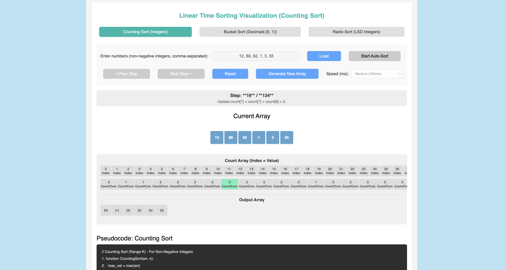

# LinearSort Visualizer

An interactive, hardware-accelerated educational platform engineered to demonstrate non-comparison, linear-time sorting execution pipelines. The platform provides developers and computer science students with crisp, reactive visual feedback layers tracking active data element distribution matrices across Counting, Radix, and Bucket sort algorithms.

The application is built to prioritize smooth interface updates. By using localized state vectors combined with asynchronous delay interpolation loops, the platform isolates computational array sweeps from the rendering UI canvas, maintaining a fluid 60FPS visualization frame-rate under dense dataset distributions.

### Application Preview and Layout Design

<p align="center">
  
</p>

---

## Table of Contents
1. [Core Features & Algorithm Architecture](#1-core-features--algorithm-architecture)
2. [Codebase Composition & Layout](#2-codebase-composition--layout)

---

## 1. Core Features & Algorithm Architecture

The visualizer bypasses standard comparison-based sort limits ($O(n \log n)$) to highlight mathematical, distribution-based linear efficiency profiles ($O(n)$):

### Computational Engine Breakdown
* **Counting Sort ($O(n + k)$):** Constructs an explicit frequency map array tracking individual element counts, transforming integer occurrence frequencies into deterministic output index keys via prefix sums.
* **Radix Sort ($O(d \cdot (n + k))$):** Evaluates multi-digit values digit-by-digit from Least Significant Digit (LSD) to Most Significant Digit (MSD) by driving a stable secondary counting engine across consecutive numeric bases.
* **Bucket Sort ($O(n + k)$):** Digitizes a localized decimal array restricted between `0.0` and `1.0`. Inputs are mathematically partitioned into isolated memory buckets before sorting individual subsets sequentially.

### Technical Performance Strategies
* **Asynchronous Execution Delays:** Leverages explicit execution delays (`await Promise`) inside sorting generator routines to pause iteration logic cleanly, allowing step-by-step element distributions to reflect accurately on screen.
* **Framed Structural Motion:** Integrates `framer-motion` configurations to bind container updates directly to physical layout shifts, removing jarring document reflow cuts during high-frequency sorting intervals.

---

## 2. Codebase Composition & Layout

The structural workspace splits interactive components and dynamic style layers cleanly to protect interface responsiveness:

```text
linear-sort-visualizer/
├── src/
│   ├── App.js        # Core React application shell, state hooks, and sorting engines
│   ├── App.css       # Custom presentation templates and gradient background definitions
│   └── index.js      # Production workspace application bootstrap entry point
├── package.json      # Workspace dependencies including framer-motion and tailwindcss
└── README.md         # Production layout blueprint documentation